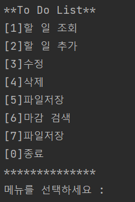
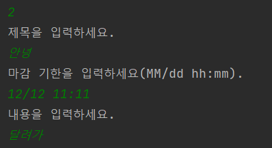
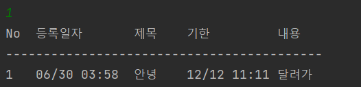
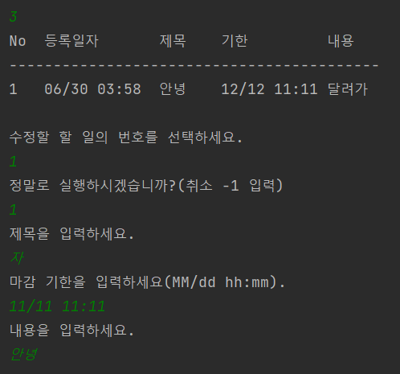
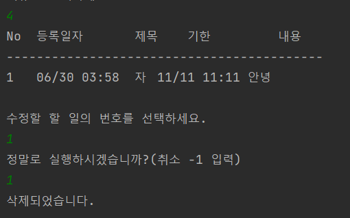
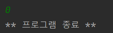
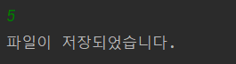
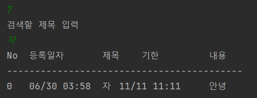
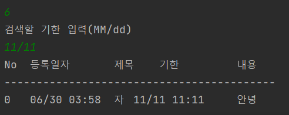

# To Do List

##Introduction
간단하게 to do list를 CRUD로 구현했다. 

## 클래스, 함수 및 기능 설명
1. Main
   
   -- Manage 함수 호출(run)
2. Manage
   
   -- 기초적인 구조를 담당한다. 여기에서 다른 클래스에 있는 함수들을 부르게 된다.   
3. Menu

   -- 매뉴얼 들을 나열하고, 원하는 메뉴를 선택하게 한다.
   
   
4. Todo

   
5. Crud
   
   Create    
   
   read      
   
   update    
   
   delete    
   
   종료       
6. FileService
   -- file I/O에 필요한 saveFile과 readFile이 있다. readFile은 프로그램이 시작할 때 파일을 읽어오게 된다.
   saveFile은 5번 파일 저장에서 사용한다.
   
   잘 로딩되었다는 표시
   
   
   saveFile
   
7. Search
   
   마감과 이름검색
   
   이름 검색 

   마감 검색 

## Step
#### 1일차
기본적인 Crud 기능으로 프로그래밍했다.
Main, Crud, Todo, Menu 구현.
당시에는 날짜를 Date type 으로 구현했다.
#### 2일차
Main 에 있던 main 외의 함수들을 Manage class 에 옮겼다. 
#### 3일차